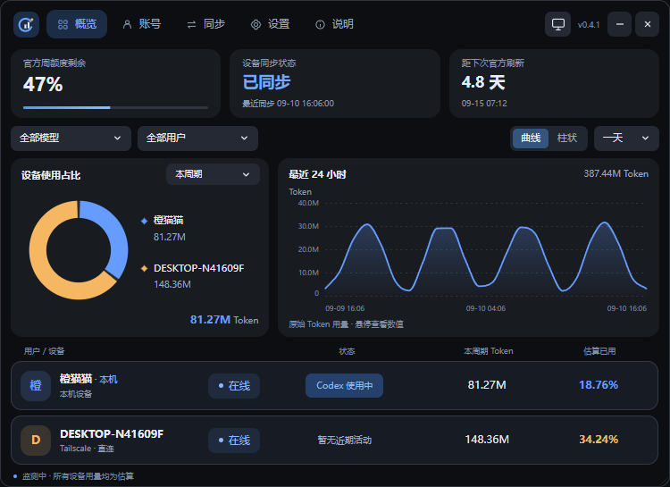

# Codex 配额管家 0.4.3

## 0.4.7

- 修复最新时间桶已记录 Token、但官方额度增量尚未到达时误显示 0.00%：悬浮提示显示“待更新”，官方增量到达后回填。已结算的记录与真实零用量区分显示。

## 0.4.6

- 图表百分比按官方额度增量、事件时间和用量权重归属，个人模式按个人配额换算；不再用 Token / 估计总量。仅展示已观测消耗，官方观测有延迟。
- 根据重置卡数量和原刷新时间区分提前用卡、官方临时重置、自然重置；送卡增加计数不触发重置。临时重置不新增欠款，已有补偿保留；缺少新卡数记录时不猜测原因。

## 0.4.5

- 曲线和柱状图悬浮提示增加所选时间单位的总用量、各用户用量占推算本周期总额度的百分比；保留 Token 数值，百分比跟随用户颜色，缺少估计时显示 —。

## 0.4.4

- 修复已移除设备的残留配额参与当前个人额度分配：有效用户各 50% 时，账号已用 33% 正确显示为个人 66%。历史账本保留。

- 两个图表的百分比统一表示所选时段 Token 占推算本周期账号总额度的比例；无估计时显示 —，不再按时段内用户份额计算。
Windows GUI：当前 Codex 账号识别、设备 Token 采集、估算周配额、内嵌 Tailscale 配对、直连优先及 DERP 加密中转。

## 0.4.3：小时图表分辨率与自然日统计

- “Codex 使用中”增加 15 秒显示缓冲，短暂采集空档不闪回空闲；离线、移除设备或切换账号清除缓冲。仅影响状态显示，不改变采集和用量归属。

- 饼图“今天”从本地每天 00:00 开始累计，次日 00:00 切换；“近一小时”和新增的“近六小时”分别滚动统计当前往前 1 / 6 小时。

- 最近一小时的柱状图为 30 个整两分钟区间，曲线保留 60 个整分钟采样点；按各自的整分钟边界汇总，刷新不移动区间边界。

## 0.4.2：周期统计、跨周期补偿与用户用量对比

- 新增“总数据”页，位于“账号”前。按账本已确认的周期保留 Token 实际记录、独立推算的周期总量、样本 Token / 额度百分比、模型构成与相邻周期的估计变化。样本不足时显示等待样本；新周期不沿用旧周期估计。
- 推算的 Token 容量受模型和缓存比例、设备是否完整同步影响，不能仅凭下降认定官方额度缩水。周期边界取已确认的官方快照，延迟观测或提前重置时可能有归属误差。
- 概览饼图右下角以主题强调色显示本周期推算总量，替换原个人总量。趋势默认“全部用户”和“一天”；选“全部用户”时柱状图按设备颜色堆叠，折线图每台设备单独显示，悬停列出明细。最近一小时显示 60 个整分钟桶，一天按整小时、周/月按自然日对齐（含当前未结束的时间桶）；一周显示七个日桶。旧数据不随刷新秒数重新分组。
- 支持账号范围的正式统计起点：累计、滚动图表及历史列表排除起点前试用记录，原始账本事实保留；后续周期继续累计。起点保存在本机设备组账本中，不会自动替另一台电脑设置起点。
- 普通后台每 10 分钟查询官方额度并同步账本，打开窗口立即恢复默认频率。连接心跳与本地 Token 采集继续；分页补传按一轮连续完成。自动限额保护期间维持必要实时性，疑似重置用短间隔再次确认。
- 周期卡片增加官方已用进度条，模型 Token 分卡展示；堆叠柱的整体轮廓使用圆角。曲线恢复轻渐变并采用更紧凑纵轴；切换为曲线从左向右绘制，柱状图从底部展开，数据轮询不重复播放入场动画。
- 每个周期以此前最近最多 3 个已结束、且能推算总量的正式周期均值为参考，在右下角展示预计减少或增加的 Token 与比例；当前周期不参与自己的参考，只有 1 个或 2 个有效参考时按已有数量取平均，无已结束参考时等待样本。这是相对历史估计变化，不是官方固定 Token 配额或缩水结论。
- 默认以个人额度为 100% 显示用量；可在设置中选择“补偿显示模式”，查看跨周期借用和归还后的已用百分比。详见文末补偿说明。

## 0.4.1：紧凑界面、设备管理与后台降耗

- Vue 3 + WebView2 紧凑界面，750 × 570 无边框窗口。图表使用 SVG；窗口、切页、下拉和悬停提供过渡动画。需要 Windows 已安装 Microsoft Edge WebView2 Runtime。
- 用户行显示独立的在线/离线连接标识，保留 Codex 活动状态；使用中为居中的短标签。点击用户打开统一备注/预设颜色设置，也可从设置页进入；按住拖动调整本机显示顺序，按账号保存。
- 移除概览“同账号设备”标题和单独编辑按钮；缩小同步字号，下次官方刷新以剩余小时显示，日期位于右下角。曲线提示框平时保持统一高度，遇到遮挡峰值时自动上移。
- 官方卡片与进度条显示剩余额度；剩余不足 10% 为柔和红色、不足 20% 为柔和黄色，缺失官方数据不触发预警。
- 模型按版本从高到低排列；`codex-auto-review` 不再列入选择项，其日志 Token 仍计入全部模型总量。
- 477 个日志的冻结副本复测：后台扫描/归属阶段 CPU 中位时间 906→344 ms，减少 62.1%；完整归属结果及 2674 条 outbox 数据一致。没有降低同步频率或改变计量公式。该结果是隔离阶段测试，非所有电脑的整机 CPU 降幅。
- 内嵌 Tailscale 组件经哈希校验后保存在固定数据目录，避免每次重启使用不同临时路径导致反复防火墙询问。首次系统授权仍可能需要 Windows 管理员确认，不修改全局防火墙策略。
- 保留账号、设备组、账本及签名更新身份，无需重新匹配。可从 0.3.x 或 0.4.0 更新；双端连接恢复后自动补齐缺失记录并校准。同步完成以实际回执为准。
- WebView2 的内存开销比旧 Tk 界面高；此前隔离 UI 测试为约 291 MiB 对 91 MiB。实际屏幕 FPS 未测量，不宣传未经验证的帧率优化比例。

下面保留此前版本的变更和验证说明。

## 0.4.0：WebView2 紧凑仪表盘（本地试用构建）

界面使用 Vue 3 和 Windows WebView2；Python 继续负责原账本、采集、模型权重、校准和设备同步。无需安装 Python。Windows 需要 Microsoft Edge WebView2 Runtime；本机已验证现有运行时可用。

- 默认 750 × 570 窗口，横向导航与圆角窗口；移除系统灰边、顶部账号说明行和概览滚动条，支持右下角缩放、最小化和关闭到托盘。设备行与字体放大；官方额度进度条收在总量卡片内，自动限额仅放在设置中。
- 第二张卡片展示最近实际确认同步的时间和账本同步状态，区分已同步、同步中、等待确认、同步异常与未连接；连接在线不直接视为账本已齐。
- 饼图默认显示本周期，与设备列表共用周期用量；可切换最近一小时／历史累计／一天／七天／一个月；图表只展示当前设备的已同步原始 Token，支持模型与用户筛选。加权用量只用于设备估算已用，不作为图表计量选项。
- 曲线／柱状图显示最近 24 小时（每小时）、7 天（每 6 小时）、30 天（每天）的区间用量，不是累计值。已移除设备不再出现在概览图表和筛选中，其历史账本未删除；当前设备离线时仍保留其已同步用量。
- 纵轴使用整齐刻度并标明单位，日期轴对应真实统计窗口。
- 设备配额和估算已用百分比口径统一放到设置：账号总额度，或将个人分配额度视为 100%。例如账号占用 16.76%、个人配额 50%，个人已用为 33.52%；此切换只改变显示，不改变限制策略。
- 图表使用 SVG 矢量边缘、保形平滑曲线和浏览器动画时钟。曲线穿过每个采样点，不产生额外峰值；悬停显示区间开始时间和真实区间用量。
- 选择设备后点击“备注”，最多 40 字；备注按账号保存在本机，留空恢复原名，不改变设备身份或配对。
- 选择设备后点击“颜色”，可从 8 种预设中选择该用户的图例、用量文字和专属曲线／柱状图颜色；按账号在本机保存。
- 卡片和按钮使用浏览器圆角与抗锯齿，按钮文字居中；设备图例采用固定对齐列及高对比颜色，估算已用数值着色。任务栏、托盘和程序使用统一的新图标。
- 账号页保留历史与补记详情，同步页保留连接详情、刷新与诊断导出。图表是只读汇总，不改变模型权重、官方查询、配额分摊或限制策略。
- 按钮颜色缓动、切页滑入、下拉淡入、首次启动淡入和窗口收起过渡与图表悬停动画只在交互或数据变化时触发；不变的数据不会重建下拉菜单，拖动由 Windows 原生移动循环处理，不再经过 Python 逐点移动和 Pillow 重绘。饼图中心留空，悬停用量显示在卡片左下角。

- 本机 WebView2 图形探针已确认使用 RTX 3080 Ti / Direct3D11；这不等于所有机器或每一项绘制都由 GPU 完成。新旧版同账本性能比较和内存代价见 [docs/performance-baseline.md](docs/performance-baseline.md)。
- 这是保留 0.4.0 版本号的本地试用修订，尚未发布 GitHub Release 或自动更新。双端运行期间继续按原协议自动同步并重算，远端实机收敛情况仍需双方试用确认。

## 0.3.2：周期加权重算与同步诊断

- 按整个额度周期的加权 Token 重算设备分摊；新增与补传记录都修正比例，原始 Token 不变。
- 修复同步错误被刷新覆盖，显示账本待收发记录数；导出数值诊断包含权重与待归属原因。
- 重算后低于限额可自动解除限制；保留账号隔离、基线与未知权重保护。
- 两端均须升级才能使用相同分摊规则；无需重新匹配。待归属记录不等于 API，不强行计入订阅账号。

## 0.3.1：连接修复与网络切换

- 修复 Windows 本地 HTTP IPC 未读完请求体导致连接重置的问题；真实 1,200 次状态／收件请求无重置。
- 显示内嵌节点实际所属 tailnet，区分本地通信故障、对端不可见与同步端口不可达。
- 新增“换账号 / 切换 Tailscale 网络”，二次确认默认取消，保留设备组和账本；切换后重新交换匹配码。
- 不同 Tailscale 账号可以加入同一个 tailnet；接受网络邀请不会自动迁移已授权的内嵌节点。

## 0.3.0：真正内嵌 Tailscale 与轻量化

- 不用另装 Tailscale。主 EXE 内含私有 tsnet 节点，首次点击“授权登录 Tailscale”在浏览器授权，两端须加入同一 Tailscale 网络。它不安装系统网卡、系统服务，不修改全局路由。
- 原设备组发起方保留原账号、设备 ID 和组密钥，点击生成新版 `CQG4` 匹配码；接收方先粘贴匹配码保存，再点击授权登录；已授权无需重复登录。旧 `CQG1/CQG2` 不能连接新版，需要刷新匹配码，旧账本不删除。
- 用原 AES-GCM 加密消息直接传输增量账本，不再走 Syncthing 公共中转。生产包不含 Syncthing、aiortc 和 PyAV/FFmpeg 音视频库。
- UI 根据近期实际路径探测显示 `Tailscale · 直连`、`Tailscale · DERP 中转 (区域)`，失败或过期显示“路径待确认”。如果用户另配了 Peer Relay，则如实标示。节点授权、对端握手和用量回执分别显示。
- 设备总览支持从组中移除其他设备，默认取消的二次确认；移除行消失，其他成员同步移除状态。重新输入匹配码可再次加入，重启不会自动恢复，历史账本保留。所有成员请升级到 0.3.0。
- 修复本地 IPC 短暂重置导致节点反复重启、登录提示错误的问题。主 EXE 约 41.4 MiB，比 0.2.6 缩小约 49.5%。
- 已验证本机真实授权与本地 IPC 恢复；异地同步、网络切换和长期稳定性仍需实机验收，不把演示截图当作公网实测。
- 架构、迁移、安全与验收边界见 [docs/TSNET.md](docs/TSNET.md)。构建需 Go 1.26.6 或更新版本，`build.ps1` 自动编译锁定依赖的 Go helper。

下面的 0.2.x 章节为历史发布说明，其中 Syncthing、旧匹配码与自建 WSS 的流程不适用于 0.3.0。



## 0.2.6：同步收敛、活动状态和 Token 口径

- 文件同步使用经过加密包上限验证的大批次传输。以实际三设备账本回放，完整历史从约 147 轮降至约 21 轮；旧客户端仍按原小批次兼容。
- 可见界面最多约 2 秒、本机托盘后台最多约 5 秒扫描活动并发送心跳。`turn_context`、`response_item` 和 `token_usage_record` 可作为运行中证据，明确完成后的尾随统计不会重新标为使用中。
- 相同官方额度快照不再每 30 秒写入同步历史；数值变化或每 10 分钟检查点仍持久同步，减少长期账本膨胀。
- 顶部改为“本周期已同步 Token”，直接显示当前已同步设备日志合计；官方额度百分比和设备加权分摊仍分别显示，不再把历史校准外推值写成已用 Token。
- 历史补记文案明确为累计值，避免和当前额度周期混淆。账号、配对、统计数据和加密协议保持兼容。

## 0.2.5：修复监测中断和设备状态误报

- 修复历史补记把 Provider 冲突标记当作账号，触发 `IndexError: list index out of range` 的问题。
- 历史补记异常时继续更新设备心跳和总览，显示补记错误并自动重试；该轮不执行自动限额判定。
- 对连接在线但监测心跳过期的设备显示“连接在线·监测状态过期”，避免误报断开。
- 保留账号、配对、统计数据与现有通信协议。双方建议升级；旧版对端的监测异常不能仅靠本机升级修复。
- 正式版包含沿用原签名身份的 `update.json`；可在“检测更新”升级，也可手动下载。签名公钥和校验机制不变。

## 0.2.4 正式版：运行实例身份归属与配对兼容

- 只读索引本机 `logs_*.sqlite` 的 `process_uuid`、`thread_id`、结构化 `turn.id` 与 `account/updated` 通知；仅保留关联元数据，不保存日志正文、对话或凭据。按增量游标限量扫描，索引未完成时不做运行实例推断。
- 使用已有直接采集或额度相关证据给连续运行区间绑定账号，跨会话补记标记 `runtime_inference`，保存进程与锚点来源。不同启动 UUID 不继承，即使 PID 相同；配置切换切断新回合继承，实际身份通知另切分进程区间。账号或 Provider 冲突时不猜测。
- 切换至 API 或其他账号后，能关联到旧运行实例的旧请求尾部仍补到原已添加账号，仅写入对应本地账本，不使用当前连接同步另一个账号。迟扫描不会改变事件发生时间。回合内实际身份切换后的用量缺少逐请求关联时保留待核对，不能把整回合都认作旧请求。
- 升级自动重读数值索引以补齐 `turn_id`，不清空已有账本或重复计数。其他设备升级后自动执行同样的本地恢复；尚未保留的原始日志无法凭新版生成。
- 账号额度卡新增同期 Token 已用／总量估算，以已知设备同步样本校准，并用官方百分比外推账号共用消耗；缺少新同步时保留历史比例，无样本显示待校准。`≈` 不是官方 Token 上限，也不能证明没有未配对设备。
- 修复 Windows 较长用户名／数据目录下密文文件路径超过传统长度限制导致的 `FileNotFoundError` 和连接反复重启。使用扩展长度路径进行本机邮箱读写，保留文件名、配对关系和加密协议，不要求修改注册表。

## 0.2.3：本机历史自动补记

- 升级启动后自动扫描本机 `sessions` / `archived_sessions`，在独立表中保存数值证据和续读位置；不删除旧账本、不重置采集高水位、不保存对话内容。
- 首次启动、旧版升级、重启或配置变化导致漏采的 Token，不再永久跳过：日志中的主池周额度、重置时间与账号历史快照匹配后自动补记，并使用原同步协议补传给设备组。其他设备升级后各自扫描自己的日志。
- 归属依据标记为 `quota_correlation`，保留匹配快照时间；这是相关性推断，不是官方逐请求设备账单。仅允许唯一账号周期、相同额度值、90 秒内的对应快照，或前后相同快照夹住的历史区间；重置时间使用账本既有的 120 秒周期容差，兼容刷新过渡期的时间抖动，容差内出现多个账号则拒绝推断。账号冲突、API / Spark、没有证据、未添加时段及已拒绝的账号切换事件不会强行入账。
- 按用户要求放宽连续会话收录：直接采集记录或额度快照匹配记录可作为锚点，补记同一会话连续区间中缺少独立账号证据的 Token；双端锚点标记 `interval_inference`，单端继承标记 `session_inference`，保存所用锚点事件 ID。其他账号、Provider、额度指纹冲突以及已拒绝记录会截断传播；推断记录不能再作为锚点递归扩散。不跨会话批量套用当前登录账号。
- 重放按会话累计计数去重，与旧 outbox 使用相同事件 ID；分页尾部不把之前累计量当成本次新消费。历史快速模式只使用日志中已有的 `service_tier`，缺失时按标准相对权重估算，不套用今天的快速模式。
- 总览显示自动补记及本机日志待核对的 Token；账号账本列出未归属额度周期及缺少 Token 或未知模型权重的原因。只有一个设备有 Token 的周期不因模型权重未知而挂起；多设备未知权重仍不编造比例。
- 没有原始日志、缺少账号证据、未运行采集的其他设备或云端消费，无法保证全部还原。不会将待归属 Token 强行计入某账号；周期比例仅是已采集设备之间的分摊约定，不代表误差归零。

## 0.2.1 正式版：配对状态改进

- 独立四步状态：匹配信息、连接通道、同账号设备、收到同步；不会把保存配置当成连接成功。
- 接收方“保存并开始连接”：配置立即保存，连接与同步异步进行；页面持续显示进度，不用重复粘贴。
- 发送方明确显示准备耗时、超时和重试；生成的匹配码在页面内保留，弹窗关闭后仍可复制。
- 展示连接方式、每台对端最后收到同步的时间。只有通过账号校验并被账本处理的数据才更新同步时间。
- “收到同步”不等于全部历史补传完成；无法确定对端是否在线、是否已粘贴或账号是否一致时，明确显示待确认，不编造故障原因。
- 正式版附带签名更新清单，0.2.0 可通过内置更新功能升级。

## 0.2.2 正式版：续读与首次匹配改进

- 首次连接前 60 秒更及时检查接纳状态，之后恢复正常轮询；握手先于连接状态刷新到达时不再丢掉已验证的握手。
- 接纳设备与共享密文目录分别写入；短暂失败后补齐缺失步骤，不重复接纳。连续本地连接组件查询失败才重建连接，避免一次抖动就拆掉通道。
- 首次连通、收到新历史、对端版本向量推进时及时唤醒后台同步并确认；不再每批等待后台周期。稳定后的重复心跳保持低频处理。
- 已有同组连接时，重新生成匹配码复用现有通道；接收新的匹配码会刷新已保存设备的过期中转地址提示，仍保留动态发现。
- 连接就绪不计作“收到用量同步”；账号隔离、设备证明、TLS 与密文认证不变。公网发现、中转、代理和异地网络仍可能影响速度，不承诺固定连接时间。

## 0.2.0 正式版

- 单个主 EXE，内置连接组件与更新助手，无需安装 Python、Syncthing 或自行部署服务器。
- 点击生成匹配码，自动准备身份、连接公共中转并生成 CQG2 代码；另一台输入即可。首次准备通常需要数十秒，失败时显示可重试状态，不要求填写 WSS、密钥或 STUN。
- 配对代码自动携带当前中转地址，避免首次发现的负缓存延迟；长期仍使用设备身份和公共发现重连。公共服务或代理故障时可能延迟／断线，不保证所有网络均能连接。
- 设置内置“检测更新”，默认每小时自动检测正式版。Ed25519 签名清单 + SHA256 + 大小校验，通过后退出、原地替换 EXE 并重启；启动失败回滚。正在限额阻断时延后安装。
- 保留高亮自动限额状态、统一深色滑条弹窗、当前账号隔离、API 切换解除、活动与计费归属分离。

## 0.2.x 快速使用（历史）

1. 下载 `CodexQuotaGuard-0.2.6.exe` 放到固定可写目录，双击运行。默认注册本用户登录后自启动，不自动开启限额阻断。完整 ZIP 额外包含独立恢复工具、可选自建服务及许可文件。
2. 每台设备在“账号管理”点击“添加当前账号到统计”。仅明确添加的订阅账号参与查询、采集和同步。
3. 第一台打开“匹配与同步 → 生成匹配码（发送）”，等待自动准备完成，复制代码。
4. 第二、第三台点击“输入匹配码（接收）”，粘贴完整代码。两端需在线、当前登录同一个已添加账号；不用填写任何网络参数。
5. 配对身份持久保存，软件重启自动重连。更换网络可能需要等待公共发现更新。
6. 总览“设置本机账号配额”支持拖动、点击滑条或直接输入，只修改本机当前账号；其他设备不能替它修改。
7. 设置可关闭自动更新；手动“检测更新”在有新版时下载并安装。网络或校验失败保持旧版，不清空任何账本。

## 更新与数据保留

- 正式仓库：https://github.com/visaokc/CodexQuotaGuard
- 正式版：https://github.com/visaokc/CodexQuotaGuard/releases/latest
- 0.1.x 没有内置更新器，首次需退出旧版、下载并运行 0.2.0。使用同一数据目录会保留已添加账号、配额、周期与历史账本。
- 此后自动更新同一路径的 EXE，保留数据目录与启动参数的后台状态；不是内存热重载，会有短暂重启。
- 自动更新失败的同一版本不会无限重试，可手动检测重试。安装目录不可写时保持旧版。
- 默认 CQG2 走公共自动连接；已配置 CQG1 的用户仍可保留自建服务。“高级：自建服务”是可选功能。
- 配对码是组访问凭证，只发给自己的设备。取消信任应建立新设备组，不要公开代码。

## 0.1.0 升级

- 所有设备均升级至 0.2.0，并分别添加要统计的账号。旧版没有明确添加名单，不能自动视为用户已添加。
- 旧版数据库原样保留，新版使用独立 `group-v2-*` 账本，不导入可能归属不明的旧记录。首次查询的官方已用额度作为基线。
- 原匹配码可继续使用，但新旧版本通信房间隔离；不要混用版本。

**当前没有随包附带已部署的公网服务。** 已完成本机多实例测试；三台真实异地网络、NAT 和 sing-box 路线需部署后验收。

## 界面与数据

- Windows 深色 GUI、侧边导航、圆角额度卡片、设备状态列表。
- 只识别当前 `.codex/auth.json` 与 `config.toml` 的账号模式；不会把 Cockpit/CC Switch 中保存的所有账号当成当前登录账号。
- API Key / 自定义 Provider、覆盖 OpenAI base_url 的中转配置，以及未添加账号：不采集订阅 Token、不查询订阅额度、不连接账号组；检测到模式切换后解除原账号限制。
- 按官方账号 ID 隔离账本，不按邮箱文字混合。账号切换后只处理当前已添加账号；其他账号账本保留，可从“账号管理”查看。
- “同账号设备”是安装本工具且通过匹配码授权的设备，不是 OpenAI 的官方登录设备清单。
- “活动会话”依据本机日志判断，不是 OpenAI 服务端并发请求数；120 秒无更新的未结束会话为“待确认”。归属不明的已存在会话另列“待归属”，不计入当前账号 Token／限额，也不声称一定属于当前账号。
- 只支持配置的一个 Codex 数据根目录。未自动合并 WSL、远程主机、其他用户目录、多实例自定义 CODEX_HOME。
- 点击 X 隐藏到托盘，后台约每 30 秒检查，停止界面重绘；双击/点击托盘默认菜单可恢复窗口，右键“退出程序”才退出。
- 设置里的自启动默认开启。普通监测使用当前用户 Run 注册项；开启自动限制后，需管理员保存设置，改用本用户登录时运行的最高权限交互任务，避免开机后丢失防火墙权限。
- 自启动不是 Windows 系统服务：需要该 Windows 用户已登录。测试/演示命令不会注册正式自启动。

## Token 周期与历史

- 总览显示“本额度周期 Token”：本机与已配对同账号设备合计。官方新周期被确认后，该计数从新周期开始，旧周期不混入。
- 本机今日、自然周（ISO 周，周一开始）、本月 Token 按 Windows 本地时区计算，独立于额度周期。
- “账号管理 → 查看选中账号账本”可切换按日、按自然周、按月查看完整已采集历史；额度重置、重置卡、软件重启均不删除历史桶。
- 日历翻页会显示新日期的计数，但旧日期记录保留。每个账号、每台设备分别统计。
- Token 显示为 `1.50 k`、`18.40 M`，不展开全部位数。这里是可确认归属的已采集 Token，不是官方完整账单。

## 估算规则和边界

1. 从本机 session JSONL 增量读取累计 Token 的差值，事务保存游标/高水位/待上传队列。
2. 非缓存输入、缓存输入、输出分开加权；推理输出作为输出子集，不重复计数。
3. 初始相对权重参考 2026-09-06 公开 credit rates，不是订阅周额度的官方扣费公式。
4. 账号额度按 604800 秒主额度池识别，不假设周额度一定在 secondary 字段。Spark 不混入主池。
5. 采用整个额度周期重新分摊：`(官方已用 - 监测前基线) × 本设备周期加权 Token / 全部设备周期加权 Token`。同步补齐和新增 Token 都重算比例，无需等待官方百分比再次上涨；原始 Token 归属不变。两端必须使用相同版本。周期没有 Token、缺少设备档案或多设备混用未知权重模型时，暂列未归属；只有一个设备有 Token 时不需要模型间权重比例。
6. 开始监测之前的额度单列基线，不强行归属到本机。重置被确认前已经花掉的新周期用量同样作为新基线。
7. 各设备复制不可变日志和连续版本向量，按相同排序重建账本，离线补传可修正历史估算。
8. “未归属”不能识别所有漏记：未运行本工具的设备、云任务、其他共享额度功能在同一额度周期消费，仍可能被分摊给已采集设备；此规则不是官方逐设备账单。
9. 登录/Provider 配置变化、首次启动或缺少可信续读记录时，先推进日志基线并清除会话绑定；只有此后观察到的新回合才可绑定当前已添加账号。已有未确认会话的尾部 Token 不套用当前账号。新版采集器会保存已验证的续读记录：重启时仅在账号、配置文件修改标识、日志目录、设备身份和账号添加时间均未变化时保留绑定，续读退出期间及进行中回合的新增 Token；扫描中检测到账号变化即作废续读记录。旧版已跳过的历史不会因此自动恢复。
10. 模型、快速模式、缓存、日志格式、时钟误差、接口延迟都可能造成偏差。无法保证固定误差或恰好在 33.00% 停止。

独占样本仅显示校准参考（每单位权重对应的账号百分点），不代表已验证精度。权重校准系数只影响新记录。

日志不总是提供逐请求账号/鉴权来源。未反映到所选配置文件的进程内凭据、环境变量覆盖或旧进程继续用旧凭据等情况无法完整识别；不承诺这种并行混合运行的精确归属。推荐切换账号/Provider 后开启新会话，使用同一已配置的数据目录。

0.2.2 包含续读改进；0.2.3 另加独立历史证据扫描，即使没有旧续读绑定，也会尝试通过历史额度快照匹配补记正在进行及旧回合的漏采 Token。没有可匹配快照的旧记录仍保留待核对，而不是套用当前账号。

## 自动限制与恢复

- 默认关闭自动限制。开启需管理员权限，且必须选择实际 Codex EXE。
- 本工具仅创建 `CodexQuotaGuard` 组的出站程序规则。
- **限制决策按当前配置的账号做，但执行粒度是 EXE。不能隔离同一 EXE 同时运行的账号／API 请求，也无法检测未写入配置的临时命令行／环境变量切换。严格逐请求账号限流尚未实现。**
- 切换成 API、未添加账号、另一个账号或退出登录后自动解除旧限制；原账号账本和已用限额不重置。切回达到上限的原账号会再次限制；另一个已添加账号按它自己的限额执行。
- 针对 sing-box 等本机代理，额外暂停选定的 Codex 进程。不会暂停 sing-box、Python、Node 或终端，除非错误手工选中了它们，因此请仅选择 Codex。
- 暂停按 PID + 创建时间记录，防止 PID 复用后恢复错进程；重复限制不会重复增加暂停次数。
- 自动触发将至少 120 秒前的额度增量按当前周期设备权重重新分摊。会有延迟、超额和晚到记录的修正。
- 已触发的限制保持到确认新周期、提高配额或手动恢复，不随估算波动反复开关。
- 确认官方刷新后恢复。提前重置/额度回退采用连续快照确认，不因本机时间到点、网络错误或空响应而清零。
- 按时刷新、提前刷新、使用重置卡后官方周额度刷新：都通过官方周快照进入新周期，保留各设备自定上限、清零新周期已用值并恢复限制。离线设备在重新连接并取得新证据后恢复，不保证离线瞬间同步。
- 重置卡“请求成功”本身不是清零信号，必须观察到周额度实际刷新；本工具不主动用卡。自动限制在新周期继续有效，不会因为恢复而永久关闭。
- OAuth 过期、接口不可用时不能可靠确认刷新。工具不会自行旋转或修改 Codex 登录令牌；可手动恢复网络并在 Codex 刷新登录。
- 连续 3 分钟无法查询官方额度时发出一次异常提醒，避免后台静默失效；不因查询失败误清零。
- 已被服务端接收的请求/云任务可能继续运行和消耗额度，暂停本机不能撤销它们。
- `恢复Codex网络.exe` 可独立恢复本工具的暂停和规则。修改 Codex 版本后重新检查 EXE 路径。

## 安全和持久化

- 正常数据目录：`%LOCALAPPDATA%\CodexQuotaGuard`。可用 `--data-dir` 指定独立目录。
- Codex 凭据仅在本机用于访问 `https://chatgpt.com/backend-api/wham/usage`，不进入同步日志。
- 账号使用 SHA-256 标识；匹配码包含高熵设备组秘密，必须作为访问凭证保管。
- 匹配信息用当前 Windows 用户的 DPAPI 保护。复制安装包即可；不要复制数据目录给其它设备。
- 自动连接使用专用 Syncthing 实例，仅同步本工具的 AES-GCM 密文邮箱目录；TLS 校验设备证书，未知设备必须证明持有配对秘密。Codex 文件、数据库和登录凭据绝不共享。旧自建模式继续使用 WebRTC/WSS。
- 公共发现／中转由 Syncthing 社区提供，不由本项目运营；发现能看到设备 ID 与连接地址，中转可观察 IP、大小与时序，但不能解密应用消息。每台已配对设备保存加密邮箱副本。
- 所有持有同组匹配码的设备互相信任，并可上报自己的数据/配额；接收端拒绝跨设备修改配额记录。本工具不是防篡改或企业强制配额系统。

## 开发

需要 Python 3.12、Node.js/npm，以及用于编译内嵌节点的 Go。完整构建脚本会先构建本地前端资源。

```powershell
python -m venv work\venv
.\work\venv\Scripts\python.exe -m pip install -r requirements-dev.txt
npm.cmd --prefix frontend ci
npm.cmd --prefix frontend run build
.\work\venv\Scripts\python.exe -m pytest tests -q
npm.cmd --prefix frontend test
.\build.ps1
```

真实 Windows 暂停/防火墙测试只作用于测试自身创建的临时进程，需要管理员权限：

```powershell
.\work\venv\Scripts\python.exe tests\windows_safety_probe.py
```

只读本机 Codex 真实路径测试（不修改登录、不阻断网络）：

```powershell
.\work\venv\Scripts\python.exe tests\live_probe.py
```

## 参考

- Token Monitor v0.23.0：本地 Token 与账号额度是两条独立数据链路；本项目没有复制其源码。
  https://github.com/Javis603/token-monitor/tree/v0.23.0
- Cockpit Tools：核对了 `wham/usage` 查询与账号请求头路径；本项目没有复制其源码。
  https://github.com/jlcodes99/cockpit-tools/blob/main/crates/cockpit-core/src/modules/codex_quota.rs
- 公开计价比例：https://learn.chatgpt.com/docs/pricing
- aiortc：https://aiortc.readthedocs.io/

附带 `THIRD_PARTY_NOTICES.txt` 列出打包依赖，完整许可证见 `licenses/`。Syncthing 修改文件、构建方式和许可见 `vendor/syncthing/BUILD.md`；发布 ZIP 中对应 `syncthing-source-notices/`。

发布签名：本机运行 `scripts/sign_update.py`，私钥只存于忽略的 `.private/`，不得提交或上传。构建命令见 `build.ps1`，独立 EXE、ZIP 和签名清单一起发布。

### 周期分摊诊断（0.3.2）

- 设备总览显示账本待收发记录数；网络连通不等于日志同步完成。
- 导出同步诊断包含算法标识 `cycle_weighted_v1`、加权用量及待归属原因计数，不含登录凭据或对话内容。
- 待归属不等于 API：可能缺少会话或运行实例证据，也可能有额度/身份冲突。`unresolved_reasons` 给出原因和事件时间范围；缺少证据时不自动强行归属。

### 0.4.1 试用反馈修订

右上角主题图标支持白天、黑夜和跟随系统，选择自动保存。趋势新增最近一小时（每 2 分钟一格）；饼图色块留缝、右下角默认本机 Token。刷新倒计时按天／小时／分钟显示，日期在左下角。设备在线标识来自监控软件心跳，离线使用柔和红色。窗口客户区为 750×545。

### 跨周期补偿

默认显示基准为“个人额度 = 100%”；设置中的“补偿显示模式”仅切换显示，不开关补偿记账。后台按已确认结束周期的加权用量归属，记录实际超过个人分配的部分并补偿给有剩余额度的用户，余额按账号逐周期累计。两人各分配 50% 时，本周期个人用量 130% / 70%，下周期的补偿显示从 30% / -30% 开始，可用账号额度分别为 35% / 65%。正常刷新和已确认的重置卡重置均继承余额；空周期不清账，提前重置的未用额度不产生欠款。

补偿由同步的周期、用量和历史配额事实重算，重复同步不重复记账，迟到记录会修正余额；两端需更新到支持补偿的版本并同步完成才能得到一致结果。未知历史基准或无法可靠归属的周期不收费给其他用户。补偿不修改原始 Token、官方账号额度或图表；自动限额开启时按补偿后的可用额度执行。补偿起点随设备资料同步，首次升级从当前正式周期开始，不追溯此前试用历史。历史周期使用当时的配额，之后调整配额不重写既往转移。

悬浮提示采用紧凑列布局：用户名左对齐，Token、百分比分列右对齐。

周期标题行最右侧增加重置类型标签；历史证据不足的周期显示“原因未确认”。

周期类型使用圆角底色徽标，与放大的周期标题同一行；支持同步用户确认的历史周期类型。

周期日期移到进度条下方右侧；较上周期减少用柔和红色、增加用绿色，并附括号 Token 差值。
